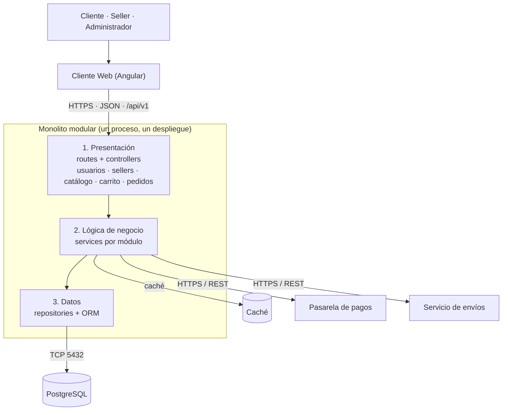

# Estilo arquitectónico

## Estilo seleccionado
Monolito modular con arquitectura en capas (presentación, lógica de negocio y datos), desplegado como una sola aplicación con una sola base de datos PostgreSQL. El frontend (Angular) se comunica con el backend mediante API REST.

## Justificación
- **DA01 Escalabilidad:** al ser una sola aplicación sin estado, se escala horizontalmente replicándola.
- **DA02 Rendimiento:** la capa de lógica de negocio usa caché para consultas frecuentes.
- **DA05 API REST:** el frontend y el backend se separan mediante una API REST.
- **DA06 Mantenibilidad:** cada módulo (usuarios, sellers, catálogo, carrito, pedidos) tiene sus propias responsabilidades y solo se comunica con otros a través de su servicio.
- Es adecuado para el alcance del proyecto: un solo despliegue y menos complejidad que microservicios.

## Reglas del estilo
1. Cada capa solo invoca a la capa inmediatamente inferior.
2. Un módulo no accede al repositorio ni a las tablas de otro módulo.
3. La comunicación entre módulos se hace llamando a su servicio.
4. Todo se ejecuta en un único proceso con una única base de datos.

## Diagrama

